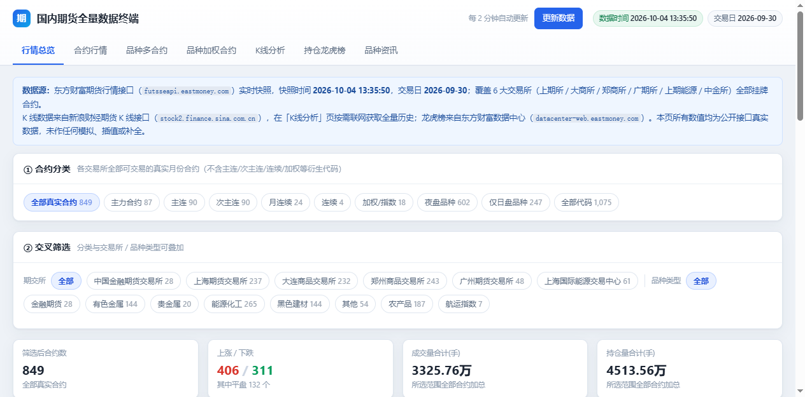
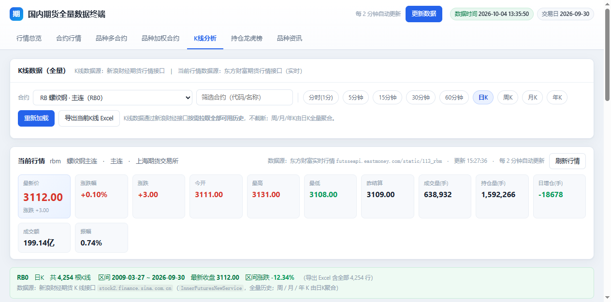
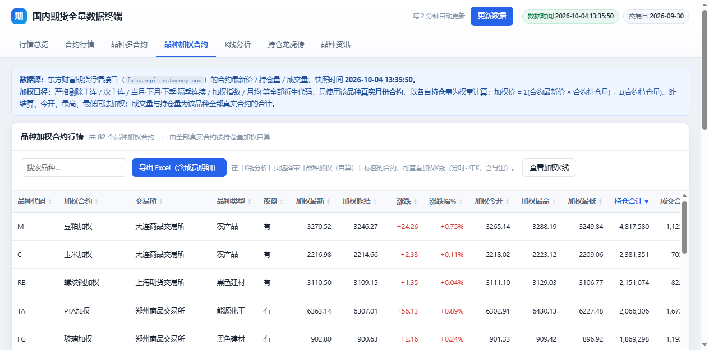

# 国内期货全量数据终端


> 一个**纯静态、零依赖、开箱即用**的国内期货数据终端：覆盖国内 6 大期货交易所全部挂牌合约的实时行情、9 周期全量 K 线、品种加权合约、持仓龙虎榜与品种资讯，全部数据来自东方财富与新浪财经的**公开线上真实接口**，无任何模拟、插值或补全。

**设计：陈专新　微信：gongqizi0**

---

## 目录

- [项目简介](#项目简介)
- [配套文档](#配套文档)
- [功能特性](#功能特性)
- [快速开始](#快速开始)
- [下载与安装](#下载与安装)
- [界面预览](#界面预览)
- [数据来源与口径](#数据来源与口径)
- [目录结构](#目录结构)
- [技术实现要点](#技术实现要点)
- [常见问题 FAQ](#常见问题-faq)
- [二次开发指南](#二次开发指南)
- [免责声明](#免责声明)

---

## 配套文档

本项目提供 **3 份完整文档**，按需查阅：

| 文档 | 面向对象 | 内容 |
|---|---|---|
| **[README.md](README.md)**（本文） | 所有人 | 项目说明：简介、功能特性、快速开始、目录结构、技术实现要点、FAQ |
| **[使用说明.md](使用说明.md)** | 使用者 | 操作手册：四种启动方式、7 个页面逐一图解、筛选与导出、数据更新、故障排查 |
| **[数据源说明.md](数据源说明.md)** | 开发者 / 风控 | 数据溯源：每个接口的完整 URL、请求参数、返回字段字典、落盘映射、请求策略、踩坑清单 |

---

## 项目简介

本项目由两部分组成：

| 组成 | 说明 |
|---|---|
| **`期货数据终端.html`** | 单文件终端（约 2.7MB），已内联 ECharts、SheetJS 与全部数据快照。**双击即可打开**，无需安装任何东西 |
| **`采集期货数据.py`** | Python 数据采集器（**纯标准库，零第三方依赖**），负责抓取全市场合约、龙虎榜、核心 K 线并落盘 JSON |

核心能力一览：

- **合约覆盖**：上期所、大商所、郑商所、广期所、上期能源、中金所 **6 大交易所全部挂牌合约**（当前 1,075 个代码，其中真实月份合约 849 个）
- **K 线全量 + 当前行情**：分时(1分)、5/15/30/60 分钟、日、周、月、年 **9 个周期**；日 K 拉取**全部可用历史**（如螺纹钢主连 RB0 有 4,254 根，最早到 2009 年），周 / 月 / 年 K 由全量日 K 聚合；K 线页顶部固定展示所选标的的**当前行情面板**（东方财富实时行情，12 项指标，加权标的按成员持仓量加权自算）
- **行情自动刷新**：页面每 **2 分钟**自动联网拉取东方财富整市行情并就地刷新（也可点右上角**「更新数据」**按钮立即手动刷新，状态区显示已更新合约数）；无需重新运行采集脚本即可盘中看最新价
- **品种加权合约**：严格剔除主连 / 次主连 / 连续 / 加权指数 / 月均等衍生代码，只用**真实月份合约按持仓量加权**自算（82 个品种）；**加权 K 线同样提供 9 个周期**——加权日 K 由全部真实合约（**含近期过期合约**，如 RB 达 41 个成员）逐日按持仓量加权合成，周 / 月 / 年 K 由其聚合，分钟级由当前挂牌成员合约实时加权
- **持仓龙虎榜**：成交持仓排名、本日合计、持仓结构、建仓过程、持仓均价、盈亏分析 **6 类数据**；下拉覆盖**全部 849 个真实合约**（按持仓量降序），支持任意交易日实时查询 + 一键导出 Excel
- **品种资讯**：87 个品种的东方财富资讯页 / 评论页、新浪财经资讯页 / 行情页链接，未建页的品种明确标注而不给失效链接
- **Excel 导出**：所有表格均支持按当前筛选结果导出 `.xlsx`（前端 SheetJS 本地生成，数据不出本机），文件名自动跟随筛选条件
- **搜索**：行情总览 / 合约行情支持**全库搜索**品种代码、合约代码、品种名称、合约名称（含「黄金→AU」等中文别名）；浏览器返回键 / 前进键可在页面与所选合约间来回切换

## 功能特性

- ✅ **真实数据**：所有数值直接取自公开接口，获取失败时给出明确错误提示与原因分析，绝不用假数据充数
- ✅ **多分类体系**：参照东方财富期货的分类方式，支持按主力 / 主连 / 次主连 / 月连续 / 加权指数 / 夜盘 / 仅日盘 / 交易所 / 品种类型（金融、有色、贵金属、能源化工、黑色建材、农产品、航运）多维交叉筛选
- ✅ **单文件交付**：HTML 双击即用；也可配合本地服务解锁离线快照能力
- ✅ **零依赖采集**：采集脚本只用 Python 标准库（urllib / json / re / concurrent.futures），Python 3.9+ 直接运行
- ✅ **红涨绿跌**：行情配色遵循 A 股 / 国内期货习惯（涨红跌绿）
- ✅ **数据源透明**：页脚内置可折叠的**「数据源说明」卡片**（位于免责声明上方），5 项数据来源与用途一目了然，来源名称**可点击直达**数据源官网

## 快速开始

### 方式〇：双击 exe 一键启动（最简单，推荐给非技术用户）

双击 **`国内期货数据终端.exe`**（约 13MB，无需安装 Python）：

- 自动启动内置本地服务并用默认浏览器打开终端页面；
- exe 与 `期货数据终端.html` 在同一目录时服务该目录（**离线快照全可用**，且重新采集后无需重新打包 exe）；
- 把 exe 单独拷到任何位置也能启动（自动使用 exe 内置的页面副本，联网功能可用）；
- 关闭启动器窗口即停止服务；重复双击不会重复开服务，只会再开一次浏览器。

> 首次运行如被 Windows SmartScreen / 杀软提示，属未签名 exe 的常见现象，选「仍要运行」即可。

### 方式一：直接打开

双击 `期货数据终端.html` 即可。

- 行情总览 / 合约行情 / 品种多合约 / 品种加权合约 / 资讯：直接查看内联快照
- K 线 / 龙虎榜：打开页面时通过 JSONP 直连新浪 / 东财实时获取（需联网）

> 提示：`file://` 协议下浏览器会拦截本地 JSON 读取，因此离线快照能力需方式二。

### 方式二：本地服务（推荐，功能最全）

```bat
:: Windows 双击即可
启动本地服务.bat
```

或命令行：

```bash
python start_server.py              # 默认端口 8907
python start_server.py --port 9000  # 指定端口
python start_server.py --no-browser # 不自动打开浏览器
```

浏览器自动打开 `http://127.0.0.1:8907/期货数据终端.html`。此模式下额外解锁：

- **龙虎榜离线快照**：74 个合约的龙虎榜直接读取本地 `data/lhb/*.json`，断网可用
- **K 线离线兜底**：新浪接口不可达时，自动回退读取预抓的核心日 K 快照（87 个品种）

**端口被占用时会自动处理**（无需手动改脚本）：

| 情况 | 行为 |
|---|---|
| 端口已被**本项目**的服务占用（重复启动） | 提示"服务已经在运行"，直接打开浏览器，不再重复监听 |
| 端口被**其它程序**占用 | 自动向后寻找空闲端口（8908、8909…）并显示实际地址 |

### 方式二·日常更新（一键脚本）

数据需要刷新时，双击 **`更新数据.bat`**，按提示选择采集模式即可（会自动完成"采集 → 打包"两步）：

```
[1] 全量：行情 + 分类 + 加权 + 资讯 + 龙虎榜 + 核心K线（约 1~2 分钟，首次使用选这个）
[2] 快速：仅行情 + 分类 + 加权 + 资讯（约 30 秒，已有龙虎榜/K线快照会被保留）
```

完成后到浏览器按 `Ctrl+F5` 强制刷新页面即可看到新数据。

### 方式三：从零构建

```bash
# 1. 采集数据（首次全量约 1~2 分钟；--quick 跳过K线预抓与龙虎榜，约 30 秒）
python 采集期货数据.py            # 全量
python 采集期货数据.py --quick    # 快速模式

# 2. 打包单文件页面
python 生成终端页面.py

# 3.（可选）启动本地服务
python start_server.py
```

依赖：仅需 Python 3.9+（无需 pip install 任何包）。数据将输出到 `data/`，最终页面为 `期货数据终端.html`。

### 方式四：重新打包 exe 启动器

修改了启动器或想自己生成 exe 时：

```bat
:: Windows 双击即可（需已 pip install pyinstaller）
打包EXE.bat
```

或命令行：

```bash
pip install pyinstaller
python -m PyInstaller --noconfirm --onefile --windowed --name 国内期货数据终端 ^
  --icon assets/logo.ico --add-data "期货数据终端.html;." ^
  --add-data "assets/logo.png;assets" --add-data "assets/logo.ico;assets" ^
  --version-file version.txt 启动器.py
```

产物为约 13MB 的单文件 exe（内含 Python 运行时、tkinter 界面与页面副本）。

## 下载与安装

除直接克隆仓库外，`release/` 目录下提供**两个开箱即用压缩包**（均已随仓库提供，同时在 GitHub Releases 中可下载）：

| 压缩包 | 大小 | 内容 | 适合谁 |
|---|---|---|---|
| `国内期货数据终端-v1.0.0-windows-x64-含EXE.zip` | 约 13MB | `国内期货数据终端.exe` + 单文件终端页面 + 快速上手说明 | **只是想用**：解压双击 exe 即可，无需任何环境 |
| `国内期货数据终端-v1.0.0-完整项目-不含EXE.zip` | 约 15MB | 全部项目产物：源码、模板、单文件页面、图标、`vendor/` 依赖、**`data/` 全部采集数据（41MB 原始 JSON）**、三份文档 | **想改 / 想重建**：解压即得完整工程，可直接重跑采集脚本 |

> 说明：仓库中默认**不包含 `data/` 原始数据**（40MB、254 个文件，且完全可由 `采集期货数据.py` 重新生成），
> 它只存在于「完整项目包」中；单文件终端页面 `期货数据终端.html` 已把全部数据内联，**克隆仓库后即可直接双击使用**。

## 界面预览

**行情总览** —— 10 类合约分类 + 交易所 × 品种类型交叉筛选 + 4 项 KPI + 实时快照表：



**K 线分析** —— 9 周期切换、当前行情面板（12 项指标，2 分钟自动刷新）、MA / 成交量副图 / dataZoom、全量导出：



**品种加权合约** —— 真实月份合约按持仓量加权自算（非东财指数）：



## 数据来源与口径

> 📖 **本节为速查摘要。完整版（逐接口 URL、请求参数、字段字典、落盘映射、请求策略、踩坑清单）见
> [数据源说明.md](数据源说明.md)。**

### 数据源清单

| # | 数据源 | 接口 | 用途 |
|---|---|---|---|
| 1 | 东方财富 · 期货行情 | `futsseapi.eastmoney.com/list/{market}` | 全部合约实时行情快照（最新价/涨跌/成交/持仓/夜盘等），支持 CORS 可浏览器直连 |
| 2 | 东方财富 · 数据中心 · 龙虎榜 | `datacenter-web.eastmoney.com/api/data/v1/get` | `RPT_FUTU_DAILYPOSITION`（会员成交持仓/本日合计/持仓结构/建仓过程）、`RPT_FUTU_AVGPPAL`（持仓均价与盈亏），支持 JSONP |
| 3 | 新浪财经 · 期货 K 线 | `stock2.finance.sina.com.cn/futures/api/jsonp.php/...` | `InnerFuturesNewService.getDailyKLine`（日K全量）、`getFewMinLine`（分钟K），无需 Referer，支持 JSONP |
| 4 | 东方财富 · 品种资讯页 | `futures.eastmoney.com/a/{slug}.html` | 品种资讯页与评论页链接 |
| 5 | 新浪财经 · 品种资讯页 | `finance.sina.com.cn/money/future/{CODE}/` | 品种资讯频道与行情页链接 |

### 关键口径

**品种加权合约**（自算，非东财指数）：

```
加权价 = Σ(合约最新价 × 合约持仓量) ÷ Σ(合约持仓量)
```

- 参与计算的合约：**仅真实月份合约**（如 RB2410、RB2501…）
- 剔除：主力 / 次主力 / 主连 / 次主连 / 当月·下月·下季·隔季连续 / 加权指数 / 月均 等全部衍生代码
- 昨结算、今开、最高、最低同法加权；成交量与持仓量为全部真实合约合计
- **加权 K 线**：采集端抓取每个品种**全部真实合约（含近 30 个月已过期合约）**的新浪日 K（含逐日持仓量），
  逐日按持仓量加权合成**加权日 K 全量序列**（`data/weighted_kline/`，83 个品种）；
  周 / 月 / 年 K 由加权日 K 前端聚合；分时与 5/15/30/60 分钟 K 由前端**实时**并发拉取当前挂牌成员合约、
  按当前持仓量加权合成。在「K线分析」页选择带 **「品种加权（自算）」** 标签的合约即可查看与导出

**东财市场码映射**（`TRADE_MARKET_CODE`）：

| 交易所 | futsseapi 市场码 | datacenter 市场码 |
|---|---|---|
| 上期所 | 113 | 069001005 |
| 大商所 | 114 | 069001007 |
| 郑商所 | 115 | 069001008 |
| 广期所 | 225 | 069001021 |
| 上期能源 | 142 | 069001016 |
| 中金所 | 220 | 069001009 |

**龙虎榜合约代码方言**（易踩坑）：

- 郑商所：龙虎榜要求 4 位年月，行情代码常为 3 位（`AP610` → `AP2610`）
- 上期能源 / 广期所：龙虎榜代码为**小写**（`bc2611`、`nr2611`、`si2611`、`lc2611` 等）
- 其余交易所：大写 4 位年月

### 数据覆盖与已知边界

- 行情为**生成时刻快照**，重新运行采集脚本即可刷新
- 龙虎榜下拉列表为**全部真实合约**（849 个，按持仓量降序），任意合约均可联网实时查询；
  交易所仅披露活跃合约排名，非活跃合约可能无数据（页面已给出原因提示）
- 新浪分时(1分)K 只保留最近数个交易日；近期过期合约的日 K 可获取（约 2~3 年内），
  更早的已摘牌合约数据源不提供——加权日 K 的起始日期因品种而异（页面有标注）
- 品种加权日 K 为**快照**（运行「更新数据.bat」刷新）；加权分钟 K 为实时计算
- 浏览器**返回键 / 前进键**可在页面与所选合约之间来回切换（hash 路由）

## 目录结构

```
期货数据终端/
├── 期货数据终端.html      # 最终单文件终端（双击即用，已内联全部数据）
├── 国内期货数据终端.exe    # 一键启动器（双击启动服务 + 自动开浏览器，无需 Python）
├── README.md              # 📘 项目说明（本文）
├── 使用说明.md             # 📗 详细操作手册
├── 数据源说明.md           # 📕 数据接口与字段溯源
├── release/               # 📦 两个开箱即用压缩包（含 EXE / 完整项目）
├── 启动器.py              # 启动器源码（exe 由 PyInstaller 打包生成）
├── 打包EXE.bat            # Windows 一键重新打包 exe（需 PyInstaller）
├── version.txt            # exe 版本信息（任务管理器 / 文件属性显示）
├── assets/logo.ico        # 应用图标（多尺寸 16~256）
├── assets/logo.png        # logo 图（README / 启动器界面用）
├── 启动本地服务.bat        # Windows 一键启动本地服务（自动探测 Python）
├── 更新数据.bat           # Windows 一键更新数据（选模式 → 采集 → 打包）
├── 模板.html              # 前端模板（含占位符，供打包脚本内联）
├── 采集期货数据.py         # 数据采集器（纯标准库）
├── 生成终端页面.py         # 模板 + vendor + data 打包为单文件
├── start_server.py        # 本地 HTTP 服务（默认 8907，支持 --port）
├── LICENSE                # MIT
├── .gitignore
├── vendor/
│   ├── echarts.min.js     # ECharts 5.4.3（1024KB）
│   └── xlsx.full.min.js   # SheetJS 0.18.5（881KB）
└── data/                  # 采集产出（约 40MB，可由脚本重新生成；仓库默认不含，见「完整项目包」）
    ├── contracts.json     # 全部合约（1,075）
    ├── varieties.json     # 品种聚合（87）
    ├── categories.json    # 多分类体系
    ├── weighted.json      # 品种加权合约（82）
    ├── newslinks.json     # 品种资讯链接（87）
    ├── lhb_index.json     # 龙虎榜索引
    ├── lhb/*.json         # 龙虎榜快照（74 个活跃合约）
    ├── kline_core/*.json  # 核心日K快照（87 个品种）
    ├── weighted_kline/*.json  # 品种加权日K全量快照（83 个品种，含过期合约加权）
    └── meta.json          # 生成时间 / 交易日 / 统计
```

## 技术实现要点

1. **跨域策略**：`file://` 下 `fetch()` 被 CORS 阻止，因此龙虎榜（东财数据中心）与 K 线（新浪）均走 **JSONP**；东财行情接口本身支持 `Access-Control-Allow-Origin: *`，预抓后内联。
2. **采集端直连**：采集脚本使用 `ProxyHandler({})` 绕过系统代理直连，并关闭 SSL 证书校验兜底（`_create_unverified_context`），避免本机代理导致的 403/502。
3. **品种解析**：通过 `detect_kind` + `resolve_variety` 两级解析，把 1,075 个代码正确归并到 87 个品种（含 `v2610F` 月均、`ADM` 主连等方言代码）。
4. **K 线全量**：新浪日 K 接口单次返回全部历史（实测 RB0 4,254 根），前端不做截断；周 / 月 / 年 K 由日 K 按 ISO 周 / 自然月 / 自然年聚合，保证与全量口径一致。
5. **单文件打包**：`生成终端页面.py` 将 ECharts、SheetJS 与 9 份 JSON 全部内联进 HTML，产物自包含、可离线分发。

## 常见问题 FAQ

**Q1：打开页面后 K 线报“数据获取失败”？**
多为网络无法访问 `stock2.finance.sina.com.cn`，或该合约新浪代码不可用。可切换到主连合约重试；本地服务模式下会自动回退到预抓快照。

**Q2：为什么某些品种没有龙虎榜？**
交易所仅对活跃合约披露会员持仓排名，`BB EC FB JR LG PD PM PT RI SC WH WR ZC` 这 13 个品种的合约不在披露范围（或已退市），接口确实无数据。页面会给出明确提示，不会显示假数据。

**Q3：行情数据和东方财富 APP 上不一致？**
本页行情为**采集时刻快照**。运行 `python 采集期货数据.py` 重新采集后刷新即可；盘中使用建议开盘后、收盘后各采集一次。

**Q4：郑商所合约代码怎么变成 4 位了？**
郑商所行情接口返回 3 位年月（如 `AP610`），而龙虎榜要求 4 位（`AP2610`）。脚本已自动补全，前端展示以行情代码为准。

**Q5：数据会不会上传到别的地方？**
不会。所有请求由你的浏览器 / 本机脚本直接发往东方财富与新浪财经；Excel 导出由前端 SheetJS 本地生成，全程无任何中间服务器。

**Q6：用快速模式会不会把已有的龙虎榜 / K 线快照清掉？**
不会。`--quick` 只刷新行情类数据，会**沿用**上一次已落盘的龙虎榜索引与核心 K 线索引（快照文件本身也不删除），页面上"龙虎榜 74 / 核心K线 87"等统计保持不变。

**Q7：双击 `启动本地服务.bat` 提示端口被占用？**
新版 `start_server.py` 已自动处理：若 8907 上已经是本项目的服务，会直接打开浏览器；若是别的程序占用，会自动改用 8908/8909… 并显示实际地址。也可手动指定：`python start_server.py --port 9000`。

**Q8：能接其他数据源吗？**
可以。修改 `采集期货数据.py` 中的接口封装与 `模板.html` 顶部的 `APP.sources` 登记表即可；页面页脚「数据源说明」卡片会自动同步。字段级说明请对照 [数据源说明.md](数据源说明.md)。

**Q9：GitHub 上怎么没看到 `data/` 目录？**
`data/` 是采集产出（40MB、254 个文件），完全可由 `采集期货数据.py` 重新生成，因此仓库默认不收录，它只存在于 `release/` 下的「完整项目包」中。而单文件终端 `期货数据终端.html` 已内联全部数据，**克隆后双击即可用**，无需 `data/`。

## 二次开发指南

| 需求 | 做法 |
|---|---|
| 刷新行情快照 | 页面右上角点**「更新数据」**（盘中临时看最新价）；或双击 `更新数据.bat` 选 1 或 2；或 `python 采集期货数据.py` + `python 生成终端页面.py` |
| 只要盘中最新的行情 | 双击 `更新数据.bat` 选 **2（快速模式）**，约 30 秒 |
| 更新龙虎榜 / 核心K线快照 | 需全量采集（模式 1 / 不加 `--quick`） |
| 修改页面 UI / 逻辑 | 改 `模板.html`，重新打包；模板内 `APP` 对象集中管理作者与数据源信息 |
| 修改服务端口 | `python start_server.py --port 9000`，或改 `start_server.py` 中 `PORT` |
| 新增交易所 / 市场 | 在采集脚本 `MARKETS` 配置中加入市场码，并补全 `TRADE_MARKET_CODE` 映射 |
| 导出更多字段 | 在对应 `dataTable` 的 `columns` 中加列，导出会自动跟随 |

## 免责声明

本项目为**数据聚合与可视化工具**，所有行情、K 线与龙虎榜数据均来源于东方财富、新浪财经的公开接口，版权归数据提供方所有。数据仅供学习与研究参考，**不构成任何投资建议**；因数据延迟、错误或缺失造成的任何损失，本项目不承担责任。请遵守数据源网站的服务条款，勿高频请求。

---

## 作者

**设计 / 制作：陈专新**　微信：**gongqizi0**

如果这个项目对你有帮助，欢迎 Star ⭐ / Fork / 提 Issue。
